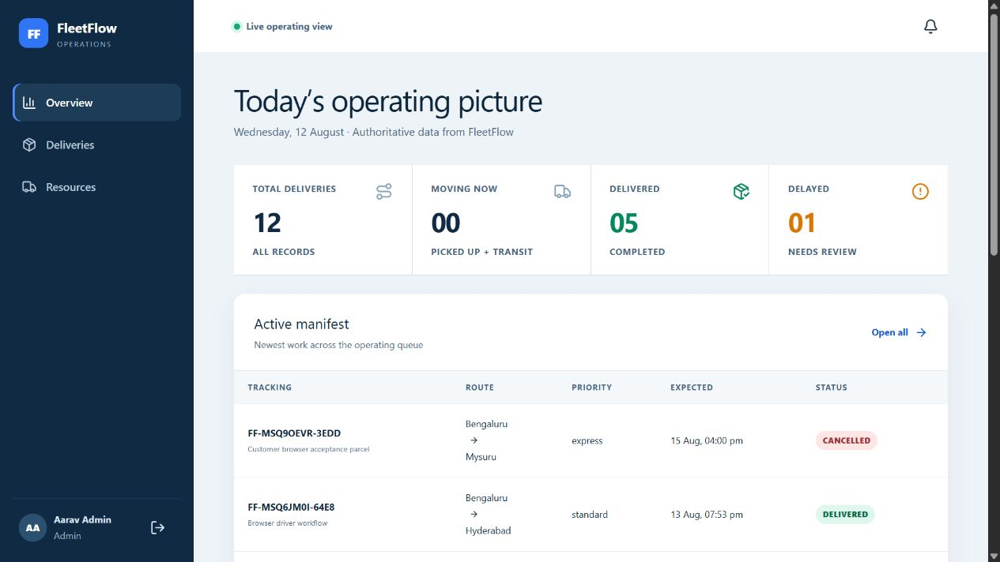
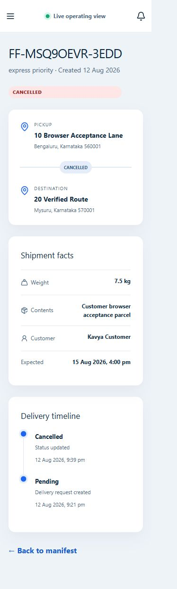

# FleetFlow

FleetFlow is a full-stack logistics operations platform for managing customers, drivers, vehicles and the complete delivery lifecycle. The project is intentionally structured as an interview-explainable modular monolith: business rules live in services, HTTP controllers stay thin, and MongoDB remains the source of truth.

The application includes role-aware dashboards, authenticated delivery APIs, transactional assignment, realtime update infrastructure, a delayed-delivery worker, analytics, audit records and automated tests.

## Workspace

- `client/` — React and Vite web application
- `server/` — Express API, Socket.IO, MongoDB and BullMQ worker
- `docs/` — architecture, database, API, deployment and interview documentation

## Quick start

Requirements: Node.js 22+, MongoDB 7+, and Redis 7+.

```bash
cp server/.env.example server/.env
cp client/.env.example client/.env
npm install
npm run seed
npm run dev
```

Development web: `http://localhost:5173` · Docker web: `http://localhost:8080` · API: `http://localhost:4000/api/v1` · health: `http://localhost:4000/health`

## Features

- Registration, login, rotating HTTP-only refresh sessions and logout revocation
- Required test-mode phone verification for new customers and drivers, with expiring single-use codes
- Admin, driver and customer authorization with delivery-level isolation
- Driver/vehicle management and transaction-safe capacity-aware assignment
- Server-enforced delivery state machine and auditable status timeline
- Cursor pagination, full-text search and operational filters
- Authenticated Socket.IO rooms and authoritative refetch design
- BullMQ delayed-delivery alerts with deterministic idempotency
- MongoDB aggregation analytics and accessible responsive dashboards
- Delivery OTP/proof service with private ImageKit cloud storage and expiring signed access links
- Permission-based live driver GPS with a persisted last position and authorized realtime map updates

## Demo accounts

After `npm run seed`, all use password `Demo1234`:

| Role | Email |
|---|---|
| Admin | `admin@fleetflow.demo` |
| Driver | `driver@fleetflow.demo` |
| Customer | `customer@fleetflow.demo` |

All seeded data is synthetic.

## Commands

```bash
npm run dev            # client and API
npm run start          # production API
npm run seed           # deterministic demo records
npm run lint
npm test
npm run build
npm run worker -w server
```

## Docker

Copy `server/.env.example` to `server/.env`, replace secrets, then run `docker compose up --build`. The client is at `http://localhost:8080`. Compose initializes the MongoDB replica set required for transactions.

## Environment

Server variables are documented in `server/.env.example`; client variables are in `client/.env.example`. Never commit the real files. `PHONE_VERIFICATION_MODE=test` keeps the portfolio flow free: the server generates a short-lived code and the interface labels it as test-only instead of claiming that an SMS was sent. Add `IMAGEKIT_PRIVATE_KEY` and `IMAGEKIT_URL_ENDPOINT` from a free ImageKit account to enable optional proof images. The private key stays on the API server; proof files are private and the app generates five-minute signed viewing links.

## Documentation

- [Architecture](./ARCHITECTURE.md)
- [Database design](./DATABASE_DESIGN.md)
- [API reference](./API_DOCUMENTATION.md)
- [Interview guide](./INTERVIEW_GUIDE.md)
- [Learning plan](./LEARNING_PATH.md)
- [Deployment](./docs/DEPLOYMENT.md)

## Screenshots

These screenshots were captured from the rebuilt Docker application during the 2026-08-12 browser acceptance pass. They contain synthetic demonstration data.

### Admin dashboard — desktop



### Customer delivery — mobile



## Verified acceptance status

The 2026-08-12 acceptance pass exercised login/logout, registration validation, role-specific dashboards, delivery search/filter/empty/loading states, customer request and cancellation, Admin assignment availability, the complete driver lifecycle and OTP proof, and Admin resource/account forms in a real Chromium browser at desktop and mobile viewports.

- Server tests: 22 passed across 5 files
- Client tests: 2 passed across 2 files
- ESLint: passed with zero warnings
- Vite production build: passed; 2,269 modules transformed
- `npm audit`: 0 vulnerabilities
- Docker: client, server, MongoDB and Redis healthy; worker running (no Compose healthcheck is defined)

See [the acceptance report](./docs/ACCEPTANCE.md) for the exact commands, browser coverage and limitations.

## Production notes

Use a managed MongoDB replica set and Redis, serve the client from a CDN, terminate TLS, and configure the ImageKit variables for private proof storage. See the deployment guide for topology, readiness and rollback details.
